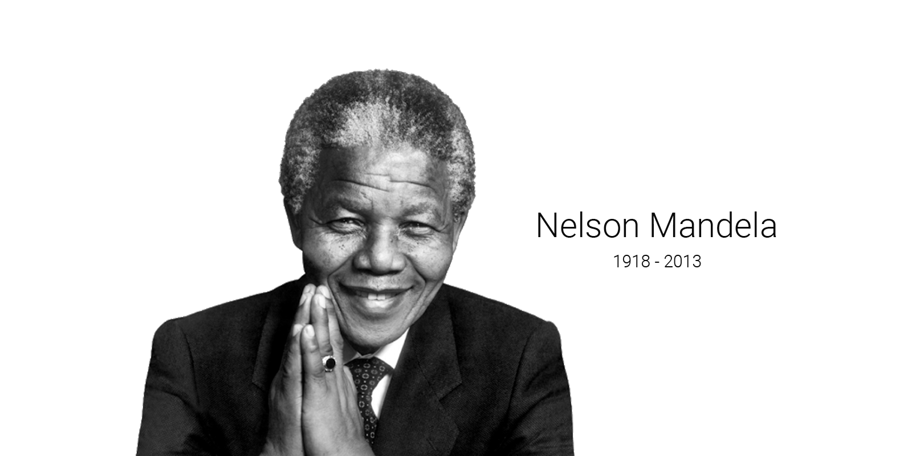

# Nelson mandela tribute page

✊🏾 A simple tribute page to Nelson Mandela

## 🕹 Test here
https://gabrieldejesus.github.io/tribute-page/

## Who was Nelson Mandela ?

### Introduction

Nelson Rolihlahla Mandela (18 July 1918 - 5 December 2013) was a South African anti-apartheid revolutionary, politician and philanthropist, who served as President of South Africa from 1994 to 1999. He was the first black chief from the country. Ideologically nationalist and African socialist, he served as chairman of the African National Congress (ANC) party from 1991 to 1997.

### Entering the political scene

Mandela, an Xhosa, was born in Mvezo of the Thembu royal family. He studied law at the University of Fort Hare and the University of Witwatersrand before working as a lawyer in Johannesburg. There, he became involved in anti-colonial and African nationalist politics, joining the ANC in 1943 and co-founding his Youth League in 1944. After the National Party's white government established apartheid - a system of racial segregation that favored whites - he and the ANC pledged to overthrow the apartheid government. Mandela was named President of the ANC Transvaal branch, standing out for his involvement in the 1952 Anti-apartheid Challenge Campaign and the 1955 People's Congress. Influenced by Marxism, he secretly joined the South African Communist Party (SACP) ). Although initially committed to non-violent protests, in association with the SACP, he co-founded the militant Umkhonto we Sizwe in 1961 and led a sabotage campaign against the government. In 1962, he was arrested for conspiring to overthrow the state and sentenced to life in prison at the Rivonia trial.

### Prison to the Presidency

Amid international pressure and the growing fear of racial civil war, President FW de Klerk released him in 1990. Mandela and de Klerk negotiated the end of apartheid and organized the 1994 multiracial general elections, in which Mandela led the ANC to victory and became president. Leading a broad coalition government that promulgated a new constitution, Mandela emphasized reconciliation between the country's racial groups and created the Truth and Reconciliation Commission to investigate past human rights abuses. Economically, the Mandela government maintained the liberal structure of its predecessor, despite its own socialist beliefs, also introducing measures to encourage land reform, fight poverty and expand health services.

## 🗃 Release history

- 0.1.0
  - Project finalized and studying the possibility of adding new resources
  - The first suitable launch
- 0.0.1
  - Work in progress

## 📝 Meta

Gabriel de Jesus – [My portfolio](https://gabrieldesenvolvedor.com/) – devgabrieldejesus@gmail.com

Distributed under the MIT License. See [LICENSE](LICENSE) for more information.

[https://github.com/devgabrieldejesus/tribute-page](https://github.com/devgabrieldejesus/)

## 🚀 Contribution

1. Make the _fork_ of the project (<https://github.com/devgabrieldejesus/tribute-page/fork>)
2. Create a _branch_ for your modification (`git checkout -b my-new-resource`)
3. Do _commit_ (`git commit -am 'Adding a new resource ...'`)
4. _Push_ (`git push origin my-new-feature`)
5. Create a new _Pull Request_

**After your pull request is merged**, you can safely delete your branch.

---
